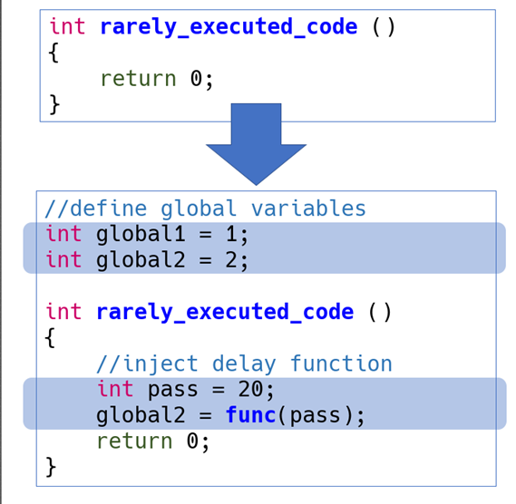
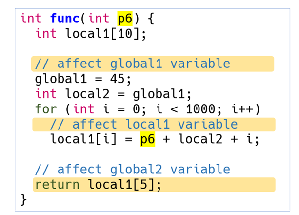
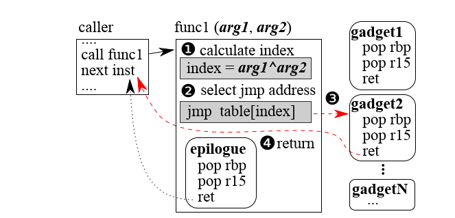
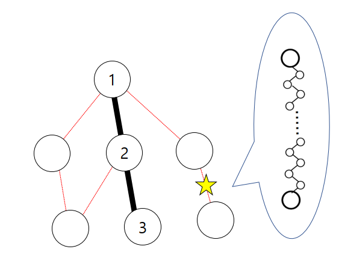
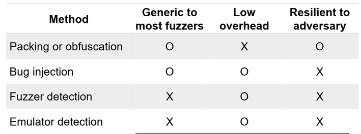

# 组会-20191018-讨论纪要

# 讨论主题

**Fuzzification:  Anti-Fuzzing Techniques**  

主讲人：瞿铸枫

# 论文内容

## Contribution

1. 阐明了反模糊方案的新研究方向，即FUZZIFICATION

2. 开发了三种FUZZIFICATION技术，以减慢每次模糊执行的速度，隐藏路径覆盖范围并阻止动态污点分析和符号执行

3. 根据流行的模糊测试和通用基准对三个FUZZIFICATION技术进行评估

   - 真实二进制文件中发现的bug减少了93％

   - 从LAVA-M数据集中发现的bug减少了67.5％

   - 在保持用户指定的开销预算的同时，覆盖率也降低了70.3％。

## Threat Model

1. Adversaries会使用fuzzing技术尝试漏洞挖掘
2. Adversaries使用现成的二进制分析技术对protected binary中的FUZZIFICATION进行分析与去除
3. Adversaries无法获取到original binary，只能获取protected binary
4. Adversaries了解FUZZIFICATION并且会尝试消除它

## Fuzzification techniques

1. SpeedBump: 针对Fast execution，放大Fuzzing执行的延迟
2. BranchTrap: 针对Fuzzing with Coverage Guidance,干扰代码覆盖率反馈
3. AntiHybrid: 针对Fuzzing with Hybrid Approaches，阻碍符号执行和动态污点分析

### SpeedBump

在极少或从不访问到的路径上注入`delay primitives`，设计成`cold path`

### BranchTrap  

#### #1 ROP-based Fake Paths Generation

收集所有函数结尾的跳转块，将等价的所有跳转块组成同一个跳转表，由`(arg1^arg2) mod total_num`作为索引在跳转表中选择跳转块。

#### #2 Saturate Feedback State

###      AntiHybrid  

1. Anti-DTA:显式数据流转换为隐式数据流  
2. Anti-SE:所有比较函数使用CRC进行间接数值的比较

# 提问

1. 论文中用极少的篇幅一笔带过`obfuscation技术不能有效的对抗fuzzing`，但是具体表现在哪里呢

2. `SpeedBump`中使用了`CSmith`注入随机代码来对抗模式匹配攻击。但是即使如此，攻击者在知道Fuzzification的情况下，能否对`CSmith`的随机代码深入分析并实现模式匹配。
3. Fuzzification假设攻击者知道Fuzzification，类似白盒密码的概念。另一方面，在不清楚或不完全了解Fuzzification的前提下，攻击者能否预测Fuzzification中可能用到的外部工具，比如CSmith，从而生成对应的模式
4. 推而广之，针对AEG等自动化系统，能否有类似的`anti-`技术