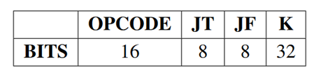
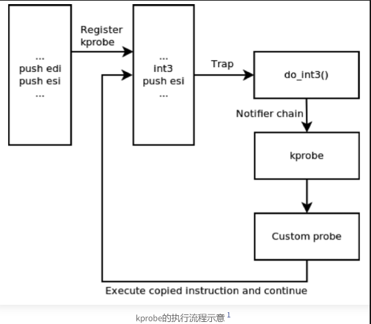

# eBPF 安全问题讨论

## 组会内容

1.对eBPF的攻击

2.对eBPF的防护

3.利用eBPF进行攻击

4.利用eBPF进行防护

### 背景-BPF

**Berkely Packet Filter[1]，BSD操作系统上的一种网络数据包过滤机制**

- 网络监控程序需要进行内核空间/用户空间的数据拷贝，开销较大
- BPF通过部署一个安全的、沙箱化的内核VM，直接实现在内核空间下的包过滤，只拷贝目标网络包

**BPF 程序和 BPF 虚拟机**

- BPF过滤器——被实现为一个布尔函数

- 返回*true*，内核将数据包拷贝到用户程序

- 返回*false*，过滤器将数据包交给网络协议栈处理

例如，过滤如下条件的包：a.IP数据包且源地址为X b.IP数据包且目的地址为Y c.ARP数据包且源地址为Y d.非ARP数据包且由Y发往X，可由下图表示，

BPF程序在内核中通过**虚拟机**执行，组成部分如下，

| **组成部分** | **描述**            |
| ------------ | ------------------- |
| A            | 32位累加器          |
| X            | 32位索引寄存器      |
| M[]          | 16*32位的临时寄存器 |
| PC           | 程序计数器          |

**BPF字节码指令格式**

- BPF程序是BPF字节码指令数组
  - opcode：操作码
  - jt：条件为*true*时，下条指令的跳转偏移
  - jf：条件为false时，下条指令的跳转偏移

  - k：含义与opcode有关

- 指令类型：load、store、jump、ret、…

指令集与寻址模式如下所示，

**BPF过滤器示例**

tcpdump用于捕获和分析系统的网络流量，下图程序用于过滤设备所以网卡上端口80上的网络流量。

**extended BPF**

随着BPF的发展，Alexei Starovoitov，Daniel Borkmann等对BPF指令集和架构进行了重塑，提出了extended BPF，即eBPF，发展历程如下，

**eBPF架构**

**eBPF指令**

- opcode：操作码

- dst：目标寄存器

- arc：源寄存器

- off：偏移

- immediate：立即数

指令集：与x86_64指令集类似、完整指令可参考官方

[文档]: https://www.kernel.org/doc/html/latest/bpf/instruction-set.html

eBPF VM寄存器：64位、512字节栈空间

**eBPF verifier**

在加载用户空间程序到内核执行前，检查其安全性。主要包括：控制流安全（不允许循环（kernel5.3开始允许有界循环）、函数调用与跳转检查、禁止sleep和block操作）、指令检查（除0、非法移位操作、非法访问栈、非法越界访问数据结构、访问未初始化寄存器）。

用到的主要算法：建立eBPF指令的DAG图、模拟执行流。

**eBPF map**

eBPF map是key+value元组，用于用户空间和内核空间共享数据、eBPF程序之间共享数据，可以通过bpf()系统调用创建。

**eBPF bpf()系统调用**

从用户空间向内核空间发送eBPF程序相关命令。

**eBPF helper**

- eBPF系统提供的功能受限函数

- 帮助内核态eBPF程序执行某些操作

- 不同eBPF程序类型可使用的helper不同

**eBPF程序类型**

具体来说，

**eBPF程序开发方式**

**eBPF安全特性——访问控制**

- 加载Linux eBPF程序需要特权

- eBPF verifier需要检测非特权eBPF程序的威胁，防止攻击者利用漏洞以在非特权eBPF程序中执行特权eBPF程序功能

- 大多数Linux发行版不允许非特权eBPF

- *kernel.unprivileged_bpf_disabled*

### 对eBPF的攻击

以CVE-2017-16995为例，它利用了整数扩展问题绕过bpf_check，具体来说：

### 对eBPF的防护

论文《基于PKS硬件特性的eBPF内存隔离机制》

针对eBPF verifier存在的“假阴性”“假阳性”问题，作者提出了以下方案：1.•使用轻量级动态检查取代静态模拟执行 2.将eBPF程序运行在内核态沙箱中，PKS实现零开销的访存指令检查。

作者将原本verifier执行的访存检查取消，而将eBPF程序放在内核沙箱中以隔离态线程的形式运行，如图所示，

作者解决了以下挑战：1.如何高效构建轻量化沙箱 2.如何为沙箱eBPF程序提供安全高效的内核交互机制。简单介绍如下，

对eBPF的防护还有其他研究工作，如《Specification and verification in the field: Applying formal methods to BPF just-in-time compilers in the Linux kernel》、《Simple and Precise Static Analysis of Untrusted Linux Kernel Extensions》、《Formal Verification of the Linux Kernel eBPF Verifier Range Analysis》等，在此不再赘述。

### 利用eBPF进行攻击

1. 利用map机制的脆弱性

   

2. 滥用tracing程序

   

   

   

   

3. 内存破坏

   

4. 滥用网络程序

   

利用eBPF技术可以构造功能强大的Rootkit，如下，可参考：https://github.com/h3xduck/TripleCross 

 

### 利用eBPF进行防护

利用eBPF可以创造一些安全防护工具，如下，

1. Tracee——基于eBPF的运行时安全和取证工具

   

2. Tetragon——基于eBPF的安全可观测性 & 运行时增强

   

3. 修复漏洞

   RapidPatch、KRSI(LSM BPF)等

## 组会问题

1. eBPF 底层的实现

   - tracepoints

     tracepoint是Linux内核预先定义的静态探测点（钩子），可以用于挂载probe函数来做trace。当没有probe函数时，它几乎没有损耗（关键词：`jump_lable`、`static_call`、`retpoline`、`meltdown`、`spectre`），**只有挂载了probe函数才会真正启用trace功能**。这个函数可以由开发者编写内核module来实现，并且需要在probe函数中获取调试所需要的信息并导出到用户态，以获取内核运行时信息。

     直接使用tracepoint并不是那么的容易，因此内核提供了`event trace`功能。event trace的实现依赖于tracepoint机制，内核提前帮我们实现了probe函数并挂到tracepoint上，当使能一个event trace时，它会输出内容到`ftrace ringbuffer`中，这样就可以获取到内核运行信息。若event trace并不符合我们的需要，则需要自己编写module来实现需求。[`/sys/kernel/debug/tracing/events/`]

     **编写****eBPF****程序就是一种probe探针的实现方式。**

     

   交互过程：

   - 用户通过文件 `/sys/kernel/debug/tracing/events/xxx/enable`与内核交互，写入`1`则开启`TP`点。
   - 内核运行过程中若`TP`点关闭，则绕过其`hook`函数，若开启则执行`trace_[name]`函数，进入`hook`函数中执行`probe`函数。
   - `probe`函数将内容输出到`ring buffer`中，用户通过`/sys/kernel/debug/tracing/trace` 读取其内容。

   参考： 

   https://blog.csdn.net/Rong_Toa/article/details/116602224

   https://zhuanlan.zhihu.com/p/596789069

   https://www.iserica.com/posts/brief-intro-for-tracepoint/

   - kprobe

     kprobe调试技术是为了便于跟踪内核函数执行状态所设计的一种轻量级内核调试技术。

     底层两种实现方式：trap和trampoline

     - 陷阱（trap）机制

     基于trap机制，我们可以在程序运行时动态插桩。kprobe的好处是无须修改代码和重新编译内核，即可向内核中的大多数函数中插桩，且位置可由用户指定。kprobe很适合用于内核调试和性能调优。出于安全性考虑，并非所有函数都能插桩。kprobe维护了一个黑名单，记录了不允许插桩的函数，其中就包括kprobe自身，以此避免递归调用。

     当用户在某条指令语句处启用kprobe后，该指令会被复制并被替换为断点（breakpoint），在x86上是`int3`指令。当CPU执行到断点后，会触发内核陷入中断处理。内核会和处理其他中断一样保存程序的状态（例如寄存器、栈等信息），当Linux发现这个中断是由kprobe安装的之后，引导至kprobe框架处理。当kprobe处理完成后，退出中断，执行下一条指令。

     kprobe可以在运行时插入任意位置，方便用户使用，但**和Tracepoint相比，性能开销更大**。此外，kprobe的接口与Tracepoint相比**不够稳定**。不过，如果kprobe被移除了，断点指令会恢复为原先的指令，不会有额外的性能负担，而Tracepoint的代码位置会有`nop`。

     

     - 蹦床（trampoline）机制

     trampoline机制是对trap机制的改进。与利用内核的中断处理机制不同，蹦床机制在原先代码上动态打上一段基于跳转指令`jmp`的代码，省去了陷入中断的开销。在较新版本的内核中，**部分kprobe**已经用基于跳转的蹦床机制优化了。这种方法的核心在于用detour buffer（称为`optimized region`）来模仿中断的行为。首先在栈上保存CPU的寄存器，然后跳转到蹦床上作为中间过渡，最后跳转到用户定义的探针函数上。当完成执行后，再反过来执行以上过程：先跳出optimized region，然后从栈上恢复CPU寄存器的值，最后执行原先的代码。

     并非所有的kprobe都支持蹦床机制，该机制有一系列的条件限制，例如目标位置的指令长度等。如果条件不满足，内核会继续使用基于陷阱的方式。

     kprobe的执行需要动态地修改Linux代码，内核提供了`text_poke_smp`函数支持这项功能。

   参考：

   https://www.iserica.com/posts/brief-intro-for-kprobe/

   https://blog.csdn.net/Rong_Toa/article/details/116643875

